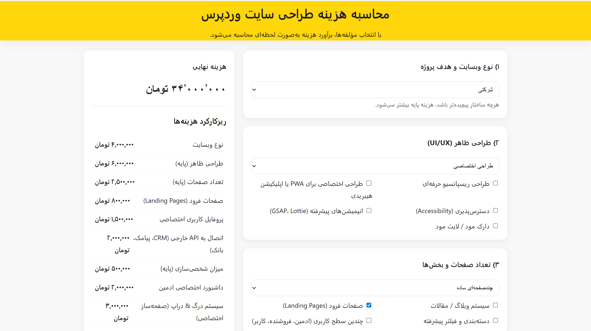

<div align="center">

# 🚀 WordPress Site Meter

### A modern, interactive pricing calculator to estimate the cost of building a WordPress website in real time — fully responsive, RTL-ready, built with clean HTML, CSS & JavaScript.

<p align="center">
  
</p>

<p>
  
  
  
  
  
</p>

<p>
  
  
  
  
</p>

### 🔗 [Live Demo →](https://morpheusadam.github.io/wordpress-site-meter/)

</div>

---

## 📖 Overview

**WordPress Site Meter** is a lightweight, **client-side pricing calculator** that helps **freelancers, developers, and web agencies** provide instant, transparent cost estimates for WordPress website projects.

By selecting project components — website type, design, pages, features, security, SEO, scalability, and more — users get a **real-time price estimate** with an itemized cost breakdown. It is perfect for client onboarding, proposals, and pricing pages. Built with clean **HTML, CSS, and JavaScript**, it requires no backend, works offline, and ships with a **Persian (RTL) interface** using the Iran Sans font via CDN.

> 🔎 **Keywords:** wordpress cost calculator, website price estimator, pricing calculator, wordpress quote tool, rtl calculator, persian pricing tool, html css javascript calculator, web agency proposal tool.

---

## 🎯 Key Features

- ✅ **10 detailed categories** for accurate cost estimation
- ⚡ **Real-time calculation** without any page reload
- 📱 **Responsive design** across mobile, tablet, and desktop
- 🌐 **RTL & Persian UI** with the Iran Sans font (loaded via CDN)
- 🧾 **Transparent cost breakdown** as an itemized list
- 🛠️ **Support packages** — monthly and yearly options
- 🧩 **Extensible architecture** — easy to add PHP, an API, or a database later
- 📦 **No backend required** — pure client-side, works offline
- 🧼 **Clean, well-documented code** for developers

---

## 🧩 Estimation Categories

| Category | Key Options |
| --- | --- |
| **1. Website Type** | Personal, Business, WooCommerce, LMS, News/Magazine, Marketplace, Community, Government Portal, SaaS, Reservation |
| **2. UI/UX Design** | Pre-made Theme, Custom Design, Responsive, PWA, Accessibility, Advanced Animations (GSAP/Lottie), Dark/Light Mode |
| **3. Pages & Sections** | One-Page, Multi-Page, Blog, Landing Pages, Advanced Filters |
| **4. Features & Plugins** | Payment Gateways, User Profiles, Chat, API Integrations, Email Automation |
| **5. Customization** | Admin Dashboard, Drag & Drop Builder, Custom Fields |
| **6. Security & Speed** | SSL, CDN, Firewall, Load Balancing, Auto Backup |
| **7. Support & Maintenance** | Training, 24/7 Support, SLA, Monthly/Yearly Plans |
| **8. SEO** | Technical SEO, Content Creation, Rank Monitoring |
| **9. Scalability** | Headless WordPress, Microservices, REST/GraphQL API, Multi-Vendor |
| **10. Advanced Features** | AI Chatbot, AR Product Preview, Gamification, Loyalty System |

---

## 🛠️ Tech Stack

| Layer | Technology |
| --- | --- |
| Markup | HTML5 (RTL) |
| Styling | CSS3 |
| Logic | Vanilla JavaScript |
| Fonts | Iran Sans (CDN) |
| Hosting | GitHub Pages |

---

## 🚀 Getting Started

### Prerequisites

- A modern web browser. No build step or dependencies required.

### Installation

```bash
git clone https://github.com/morpheusadam/PricePress.git
cd wordpress-site-meter
```

### Usage

Open `index.html` in your browser, or serve the folder with any static server:

```bash
npx serve .
# or
python -m http.server
```

Then select your project components and watch the estimated cost update in real time.

---

## 🗂️ Project Structure

```text
wordpress-site-meter/
├── index.html        # Calculator UI
├── style.css         # Styles (RTL)
├── script.js         # Real-time calculation logic
├── assets/
│   └── images/
│       └── image.png # Preview image
└── readme.md
```

---

## 🤝 Contributing

Contributions are welcome! Open an [issue](https://github.com/morpheusadam/PricePress/issues) or submit a pull request to add categories, refine pricing, or improve the UI.

## 📜 License

Distributed under the **MIT License**. See [`LICENSE`](LICENSE) for details.

---

<div align="center">

### 👤 Author — Morpheus Adam

Web developer & cheerful hacker · PHP · Laravel · Go

<p>
  <a href="https://github.com/morpheusadam"></a>
  <a href="https://sam.zeonic.me"></a>
  <a href="mailto:morpheusadam95@gmail.com"></a>
</p>

⭐ **If this tool helped you price a project, consider giving it a star!** ⭐

</div>


---

## ⭐ Star History

<a href="https://star-history.com/#morpheusadam/PricePress&Date">
  
</a>

<div align="center">

### If this project helps you, please give it a ⭐

A star helps other developers discover **wordpress-site-meter** and supports continued development.

</div>
